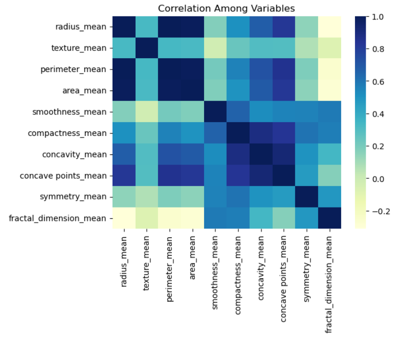

These repository features some of the small projects I did during [Python for Neuroscience](https://pyforneuro.com/) course.

# Projects

**LIF model**

This model represents how a neuron receives electrical input (the input current i),  and how its voltage builds up over time. If the voltage gets high enough (crosses the threshold), the neuron "fires" and the voltage resets. This is similar to how real neurons fire electrical impulses (action potentials) when they receive enough input.

*Simulated Membrane Potential Dynamics in a Leaky Integrate-and-Fire (LIF) Neuron Model.*

**Breast Cancer Project**

This code analyzes breast cancer data by:
1. Plotting a scatter plot with a regression line between radius_mean and texture_mean.
2. Calculating and displaying their correlation.
3. Visualizing the correlation matrix of variables containing "mean" as a heatmap.

*Scatter Plot of Radius Mean vs. Texture Mean with Regression Line and Means. Correlation between these features is 0.32.*

*Correlation Matrix of Mean Features in Breast Cancer Data.*

**Dementia Project**

This code loads dementia data, generates bar plots comparing the means and standard deviations of cognitive and demographic variables (Age, Education, SES, MMSE) across different CDR levels, grouped by gender, and calculates summary statistics for these variables.

*Comparison of Cognitive and Demographic Variables Across CDR Levels by Gender.*

